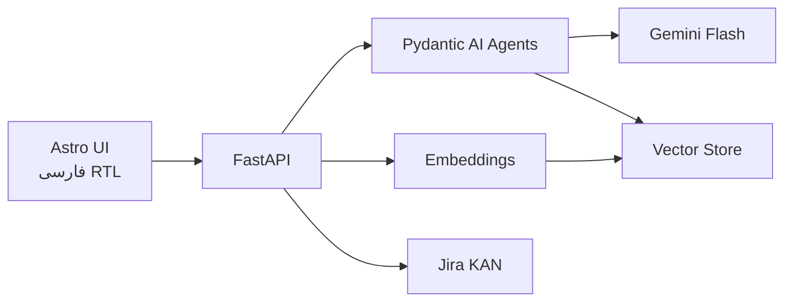

# دستیار جلسه سازمانی — Design Spec

**تاریخ:** 2026-05-26  
**وضعیت:** تأیید‌شده (با Pydantic AI)  
**هدف:** MVP دمو با UI فارسی، RAG تک‌جلسه، استخراج تسک، Jira واقعی

---

## ۱. خلاصه

اپ **دستیار جلسه** transcript فارسی (با نام گوینده) می‌گیرد، با **Gemini** خلاصه و تسک استخراج می‌کند، **RAG** برای پرسش از همان جلسه دارد، و تسک‌ها را با preview به **Jira (KAN)** می‌فرستد.

**Stack:**

| لایه | فناوری |
|------|--------|
| UI | Astro (سبک، RTL فارسی) |
| API | FastAPI |
| Agentic | **Pydantic AI** (سبک، typed tools + structured output) |
| LLM | `google:gemini-2.5-flash` (یا `gemini-3-flash-preview`) |
| Embedding | Google `text-embedding-004` |
| Vector store | JSON محلی (`data/vectors/`) |
| Jira | REST API v3 |

---

## ۲. معماری



### چرا Pydantic AI؟

- خروجی **ساختاریافته** با مدل‌های Pydantic (خلاصه، تسک‌ها)
- **Tools** سبک (`search_meeting_chunks`, `preview_jira_issues`) بدون LangChain سنگین
- یکپارچه با **Google Gemini** via `GoogleModel` / prefix `google:`
- قابل گسترش به multi-agent در sprint بعد بدون بازنویسی کل pipeline

### Agents (MVP — ۲ agent)

| Agent | نقش | خروجی |
|-------|-----|--------|
| `analysis_agent` | ingest transcript | `MeetingAnalysis` (Pydantic) |
| `rag_agent` | پاسخ سوال | `RagAnswer` + tool `search_chunks` |

Jira create از **API route** مستقیم (بدون agent) — predictable و ساده برای دمو. Preview می‌تواند tool یا helper باشد.

---

## ۳. مدل‌های Pydantic

```python
class MeetingTask(BaseModel):
    title: str
    assignee: str | None
    deadline: str | None
    priority: Literal["high", "medium", "low"]
    context: str  # جمله مرجع

class MeetingAnalysis(BaseModel):
    title: str
    summary: str
    key_points: list[str]
    decisions: list[str]
    tasks: list[MeetingTask]

class RagAnswer(BaseModel):
    answer: str
    sources: list[ChunkCitation]

class ChunkCitation(BaseModel):
    speaker: str
    text: str
    chunk_id: str
```

`analysis_agent` با `output_type=MeetingAnalysis`.  
`rag_agent` با `output_type=RagAnswer` و `@rag_agent.tool` برای `search_meeting_chunks`.

---

## ۴. API Routes

| Method | مسیر | Agent / Logic |
|--------|------|---------------|
| GET | `/api/meetings` | لیست جلسات |
| POST | `/api/meetings` | parse → embed → `analysis_agent.run` |
| GET | `/api/meetings/{id}` | جزئیات |
| POST | `/api/meetings/{id}/ask` | `rag_agent.run` |
| POST | `/api/meetings/{id}/jira/preview` | map tasks → issue payload |
| POST | `/api/meetings/{id}/jira/create` | Jira REST |
| GET | `/api/health` | env status |

Astro در dev به `http://localhost:8000` proxy می‌کند.

---

## ۵. Pipeline

### Ingest

1. Parse transcript: `[HH:MM] name: text`
2. Chunk: ۳–۵ turn گفتگو
3. Embed با `text-embedding-004` → `data/vectors/{meeting_id}.json`
4. `analysis_agent.run(transcript)` → ذخیره JSON در `data/meetings/{id}.json`

### RAG

1. Embed question
2. Tool `search_meeting_chunks(meeting_id, query, top_k=5)` — cosine similarity
3. Agent با context chunks پاسخ + citation

### Jira

- Preview: ساخت `summary`, `description`, `priority` بدون POST
- Create: `POST /rest/api/3/issue` به پروژه `KAN`
- Assignee فقط در description (MVP)

---

## ۶. UI (Astro RTL)

| صفحه | مسیر |
|------|------|
| خانه | `/` |
| جلسه | `/meeting/[id]` — تب: خلاصه · تسک‌ها · پرسش |
| تنظیمات | `/settings` |

`dir="rtl"`, فونت Vazirmatn, کد/URL در `dir="ltr"`.

---

## ۷. داده مصنوعی

`data/synthetic/meeting-01-scrum.txt`  
`data/synthetic/meeting-02-planning.txt`  
`data/synthetic/meeting-03-review.txt`

---

## ۸. Env

```
GOOGLE_API_KEY=
JIRA_SITE_URL=https://arvinzaheri17.atlassian.net
JIRA_PROJECT_KEY=KAN
JIRA_EMAIL=
JIRA_API_TOKEN=
```

---

## ۹. ساختار Repo

```
project/
├── frontend/          # Astro
├── backend/
│   ├── main.py        # FastAPI
│   ├── agents/
│   │   ├── analysis.py
│   │   └── rag.py
│   ├── services/
│   │   ├── embeddings.py
│   │   ├── vector_store.py
│   │   ├── transcript.py
│   │   └── jira.py
│   └── models/
├── data/
│   ├── synthetic/
│   ├── meetings/
│   └── vectors/
├── docs/
└── .env
```

---

## ۱۰. خطاها

| خطا | پاسخ |
|-----|------|
| Gemini fail | retry ×1 |
| Invalid transcript | هشدار + `[ناشناس]` |
| Jira 401 | پیام فارسی env |
| RAG empty | «در این جلسه یافت نشد» |

---

## ۱۱. تست (MVP)

- Unit: parser transcript, cosine search
- Integration: `analysis_agent` روی synthetic meeting-01
- Manual: Jira create در KAN، RAG ۳ سوال نمونه

---

## ۱۲. Sprintهای آینده

| Sprint | قابلیت |
|--------|--------|
| ۲ | RAG چندجلسه‌ای |
| ۳ | Agent Jira با tool + assignee map |
| ۴ | STT، auth، deploy سازمانی |
| ۵ | Multi-agent orchestrator (debate/review) |

---

## ۱۳. اسناد HTML فارسی

- `docs/پروژه-اصلی.html`
- `docs/پیاده-سازی.html`
- `docs/شرح-پروژه-دستیار-جلسه.html`

هر سند: RTL، نمودار Mermaid در wrapper LTR.
