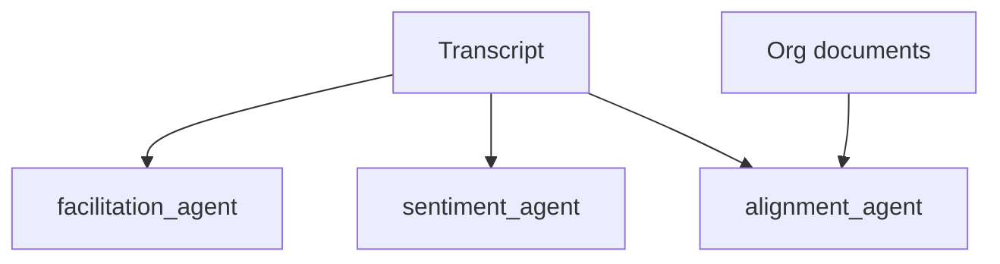

# Advanced Meeting Features — Design Spec (Planned)

**Status:** Facilitation guide **implemented** · Document alignment & sentiment planned (Sprint 6+)  
**Updated:** 2026-06-04  
**Persian HTML:** [قابلیت‌های-پیشرفته-آینده.html](../../قابلیت‌های-پیشرفته-آینده.html)

---

## 1. Facilitation guide (`facilitation_agent`)

Post-meeting coaching for organizers: what worked, time wasted, suggested agenda for next session.

| Output field | Description |
|--------------|-------------|
| `what_went_well` | 2–3 positives |
| `improvements` | Actionable suggestions |
| `next_meeting_agenda` | Draft from open tasks |
| `timebox_suggestion` | Shorter format or async alternatives |
| `facilitator_score` | Optional 1–5 rubric |

**API:** `GET /api/meetings/{id}/facilitation` — **implemented**

**Inputs:** transcript, `MeetingAnalysis`, speaker participation stats, `meeting_type`.

---

## 2. Document alignment (SOW / contracts)

Upload PDF/DOCX → Chroma collection `org_docs`. After each meeting, `alignment_agent` compares decisions/tasks to contract clauses.

| Finding status | Meaning |
|----------------|---------|
| `aligned` | Decision matches scope |
| `out_of_scope` | Likely beyond SOW/contract |
| `unclear` | Needs human/legal review |

**API:**

- `POST /api/documents` — upload + index
- `GET /api/documents` — list by project
- `POST /api/meetings/{id}/alignment` — run report

**Disclaimer:** Not legal advice; human approval required for binding contracts.

---

## 3. Text sentiment per speaker (`sentiment_agent`)

Analyze transcript tone per speaker: polarity, engagement, concern phrases, optional `hidden_dissatisfaction` signal.

**API:** `GET /api/meetings/{id}/sentiment`

**Ethics:** Facilitator/admin only; org opt-in; no public shaming labels.

---

## Priority

| Feature | Priority | Depends on |
|---------|----------|------------|
| Facilitation guide | P1 | Sprint 1 stats + new agent |
| Document alignment | P1 | Multi-collection Chroma, doc upload, Sprint 4 auth |
| Sentiment | P2 | RBAC, ethics UI |

---

## Agents diagram

